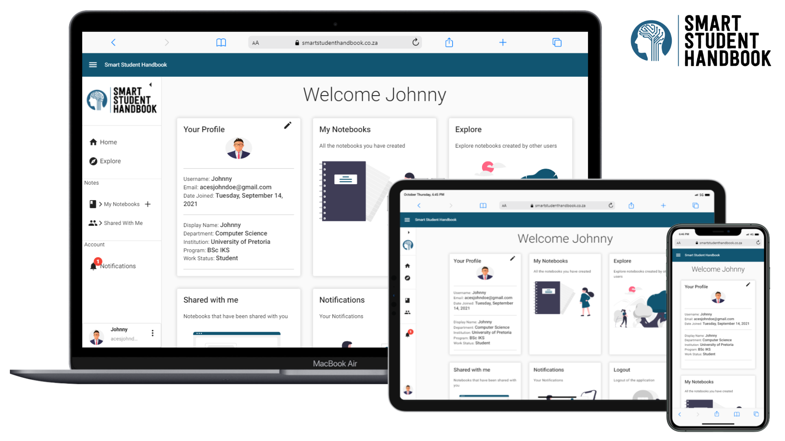
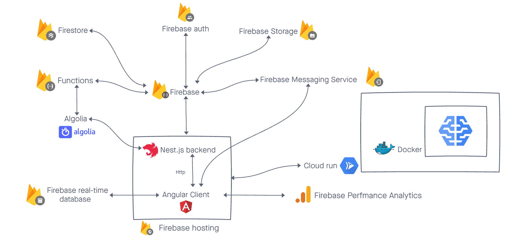

<h1 align="center" style="font-size: 300%;" > Smart Student Handbook </h1>

<a href="https://smartstudenthandbook.co.za/" target="_blank">
    

        
    

</a>

[comment]: <> ([![Quality Gate Status]&#40;https://sonarcloud.io/api/project_badges/measure?project=COS301-SE-2021_Smart-Student-Handbook&metric=alert_status&#41;]&#40;https://sonarcloud.io/dashboard?id=COS301-SE-2021_Smart-Student-Handbook&#41;)

<h1> Table of Contents</h1>

- [Project Overview](#project-overview)
- [Git Structure](#git-structure)
- [Technology Stack](#technology-stack)
- [Documentation](#documentation)
- [Project Management](#project-management)
- [Demo Video Links](#demo-video-links)
- [Meet the Team](#meet-the-team)
- [Contributions](#contributions)
- [Contact us](#contact-us)
- [Stakeholders](#stakeholders)

# Project Overview  

The Smart Student Handbook is an advanced note taking application that is aimed towards students to help aid in their
note taking experience by making it a collaborative and smart experience. It does this by recommending similar notes 
and content based off the title, description and tags of the note that the user has opened through the Smart Assist tool. 
The Smart Student Handbook also allows students to add collaborators to their notebooks so that multiple students can 
collaborate in real-time on the same notebook. Each notebook contains it's own chat room so that students who are 
collaborating can communicate while collaborating. Students are also able to explore, clone and rate notebooks as 
well as manage their account information.

🖥️  <a href="https://smartstudenthandbook.co.za/" target="_blank">https://smartstudenthandbook.co.za </a>

🎥 <a href="https://www.youtube.com/watch?v=Y33a26MP6_w" target="_blank">Final Demo Video</a>

    

# Git Structure

* Monorepo and Git Flow

### Branching Strategy

- master
    - develop
        - feature/frontend/name
        - feature/functions/name
        - hotfix/name
    
# Documentation

* <a href="https://drive.google.com/file/d/1S0fhNsPTteRIBvU27XxEIV8cAg5D1bf9/view?usp=sharing" target="_blank">Software Requirements Specification - Version 1</a>
* <a href="https://drive.google.com/file/d/1xufeD4pJSimiqJfEPHtb3o5F2NhKUaM9/view?usp=sharing" target="_blank">Software Requirements Specification - Version 2</a>
* <a href="https://drive.google.com/file/d/1JGLh4Fhxi3l_heZJIcW5p5gBFfuE28xx/view?usp=sharing" target="_blank">Software Requirements Specification - Version 3</a>
* <a href="https://drive.google.com/file/d/12vdOLsl0S-9n7SiGL_8LXcMXnOmd3O_t/view?usp=sharing" target="_blank">Software Requirements Specification - Version 4</a>
* <a href="https://drive.google.com/file/d/1Dp69_xrzX0M-2cHfKx3CMSZaZj-Qkj73/view?usp=sharing" target="_blank">Technical Installation Guide - Version 1</a>
* <a href="https://drive.google.com/file/d/1V9yUY20u2d1kO5mGtIhBYZkuje1HBYSD/view?usp=sharing" target="_blank">Technical Installation Guide - Version 2</a>
* <a href="https://drive.google.com/file/d/1je_vMYp1CMJHpwtnX4jK9WFdSrBEtP_G/view?usp=sharing" target="_blank">User Manual - Version 1</a>
* <a href="https://drive.google.com/file/d/1gqYrWPOdH-D_oPKJ_BaRfblHbcMUQmfc/view?usp=sharing" target="_blank">User Manual - Version 2</a>
* <a href="https://drive.google.com/file/d/1_y9xKgyiPChnL2VylGVnsXAIeDFPnWpb/view?usp=sharing" target="_blank">Coding Standards</a>
* <a href="https://drive.google.com/file/d/17uH99wAU_f1SNQbeAT2R9le_dP5I9XDP/view?usp=sharing" target="_blank">Testing Policy</a>

# Technology Stack

### Frontend-End

### Back-End

### Testing

### Other

## Technologies overview

  

# Project Management

* 
<a href="https://github.com/orgs/COS301-SE-2021/teams/algorithmic-aces" target="_blank">GitHub Discussions</a>: Meeting Notes 

* 
<a href="https://github.com/COS301-SE-2021/Smart-Student-Handbook/issues" target="_blank">GitHub Issues</a>: Progress tracking and issue tracking

* 
<a href="https://github.com/COS301-SE-2021/Smart-Student-Handbook/projects" target="_blank">GitHub Projects</a>: Kanban boards to track progress of tickets/ issues

* 
<a href="https://github.com/COS301-SE-2021/Smart-Student-Handbook/actions" target="_blank">Github Actions</a> Continuous integration and automated testing

* 
<a href="https://discord.com/" target="_blank">Discord</a>: Main platform used for team communication and collaboration

* 
<a href="https://www.kumospace.com/cos301-se-2021" target="_blank">Kumospace</a> & <a href="https://discord.com/" target="_blank">Discord</a> & <a href="https://www.blackboard.com/en-mea/teaching-learning/collaboration-web-conferencing/blackboard-collaborate" target="_blank">Blackboard Collaborate</a>: Platforms used to communicate and collaborate with Stakeholders

# Demo Video Links

<!-- Descriptions goes here -->

* <a href="https://drive.google.com/file/d/1EUA4RgpMf73CrgyvdYkSgxb2taklpjjw/view?usp=sharing" target="_blank"> Demo 1 Video</a>
* <a href="https://drive.google.com/file/d/1RU9e2QoeM7xnySLoLpEt9vp7Y4OvDy9l/view?usp=sharing" target="_blank"> Demo 2 Video</a>
* <a href="https://drive.google.com/file/d/13BxPY-6_oiHY_n0MLtV54MVBbIJxUrWN/view?usp=sharing" target="_blank"> Demo 3 Video</a>
* <a href="https://drive.google.com/file/d/165C0hCG0CO7W3EPH7VZvTIDQlaqbl2hC/view?usp=sharing" target="_blank"> Demo 4 Video</a>

# Meet the Team

| Louw Claassens | Luca Prenzler | Arno Moller | Douglas van Reeuwyk | Theo Morkel |
| :---: |:---:| :---:| :---:| :---:|
|  |   |   |    |  |
|     |    |     |     |     |

 

# Contributions

## Louw Claassens   | u18000402 

 What I did for Demo 1

  
  - Implemented The firebase system and the register and login functionality
  - Documentation on the SRS document.
 

 

 What I did for Demo 2

  
  - Backend Testing
  - Account, Notebook and User service

 What I did for Demo 3

  
  - Backend Note, Note, Access, Review services
  - Integration Testing
  - Technical Installation Manual 
  - Updated SRS
  - Architecture Design

 What I did for Demo 4

- Integration Testing
- Realtime chat backend
- Realtime collaboration backend
- NotebookService backend Refactor

  

## Luca Prenzler   | u18002112

 What I did for Demo 1

  
  - Implemented firebase functionality
  - Implemented  the SRS document
 

 

 What I did for Demo 2

 
  - Testing
  - Comments

 What I did for Demo 3

  
  - Explore Page
  - Backend Notification service
  - User Manual, updated SRS

 What I did for Demo 4

- Unit Testing
- User Manual
- Explore Notes
- Algolia Integration

 ## Arno Moller   | u19324058

 What I did for Demo 1

  
  - Implemented the angular frontend
  - Implemented the SRS document

 What I did for Demo 2

  
  - Front end Notebook and notes (create, edit, update, delete)
  - Smart Assist and Notes Panel

 What I did for Demo 3

  
  - Front end notebooks, notes, editor, Notifications, shared with me
  - Entire Notebook feature
  - Mobile view
  - Reset Password
  - Front end testing
  - Technical Installation  Manual, Updated SRS

 What I did for Demo 4

- Front end notebooks
- Real time collaborate
- Helped to integrate chat function into frontend
- Helped to integrate smart assist into frontend
- Swapped Editor.js with Quill.js

## Douglas van Reeuwyk   | u19049782

 What I did for Demo 1

- Implemented the angular frontend
- Implemented the SRS document

 What I did for Demo 2

- User Login and Register
- Angular front end
- User case diagrams and general SRS

 What I did for Demo 3

- Linting and Angular structure
- Menu, rooting and auth guards
- Home, Login, register and Update User
- Front end testing
- Coding standard and technical installation manual

 What I did for Demo 4

- Front-End Authentication
- Improved User Experience and Interface
- Welcome page
- Branding
- SRS update

  

## Theo Morkel   | u19002514

I am currently a Computer Science Student at The University of Pretoria

 What I did for Demo 1

  
  - Implemented firebase functionality
  - Implemented SRS documentation

 What I did for Demo 2

  
  - Continuos Integration
  - Account service

 What I did for Demo 3

  
  - Smart Assist AI
  - Backend Account, User Service, email verification and reset password
  - Deployment

 What I did for Demo 4

- Smart Assist Backend
- Smart Assist Frontend
- Add User Profile Photo 

# Contact us

- Team Email:  algorithmicaces@gmail.com
- Client email: arne.schreuder@advance.io

# Stakeholders

<a href="https://www.cs.up.ac.za/" target="_blank">
    

        
    

</a>

<a href="https://www.advance.io/" target="_blank">
    

        
    

</a>

